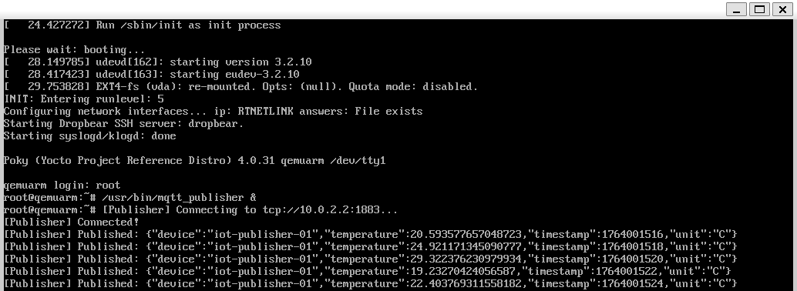
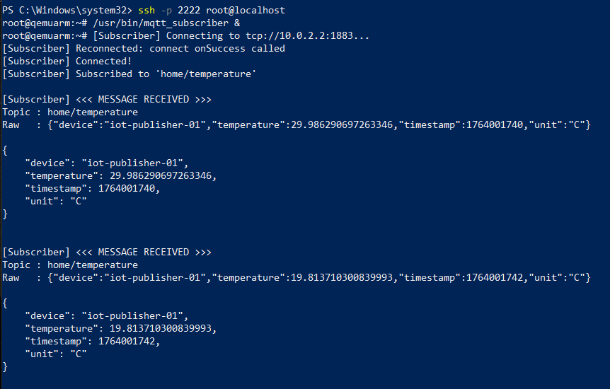

# MQTT-IoT  

A lightweight MQTT Publisher/Subscriber application written in **C++**, packaged using **Yocto**, and executed inside a **QEMU ARM** virtual embedded system.

This project demonstrates an embedded and Yocto Linux workflow:

- Building an MQTT-enabled C++ application using **CMake**
- Creating a Yocto layer (`meta-iot`)
- Packaging the application as a Yocto recipe (`mqtt-iot_0.1.bb`)
- Including an MQTT broker (**Mosquitto**) inside the Yocto image
- Running everything on a virtual embedded board using **QEMU (qemuarm)**
- Using **Dropbear SSH** to log into the virtual device and run the MQTT apps
- **Publishing dummy temperature sensor data** from `mqtt_publisher`
- **Displaying the sensor data** on the `mqtt_subscriber`

---

## MQTT Publisher  

- Running on: **QEMU console output**

|  |
|:--:| 
| *MQTT Publisher console output* |

---

## MQTT Subscriber  

- Running on: **PowerShell / Host SSH session**


|  |
|:--:| 
| *MQTT Subscriber console output* |

🔑 SSH Access

The Yocto image includes **Dropbear SSH server**, so you can access the QEMU guest from your host:

```console
ssh -p 2222 root@localhost
```


Thank you for visiting my account. :slightly_smiling_face: 

<!-- :slightly_smiling_face:

